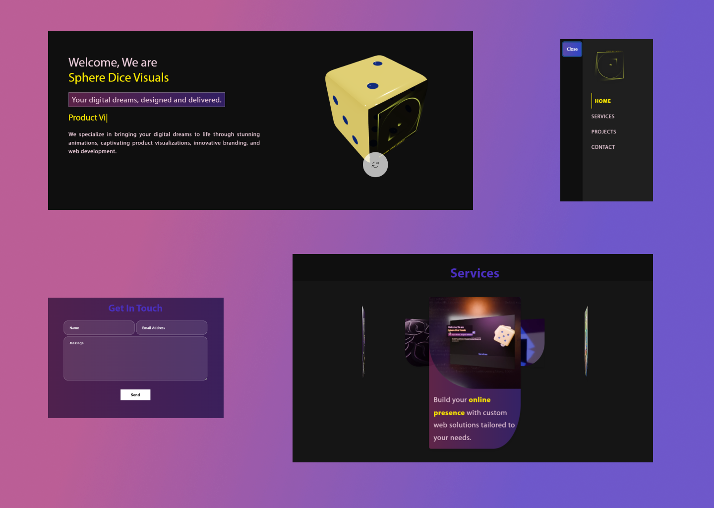

# Sphere Dice Visuals - Service Page

Sphere Dice Visuals is a digital agency providing stunning animations, captivating product visualizations, innovative branding, and full-service web development. This is the service page for the agency built with React and features 3D visual elements using Three.js.

## Table of Contents

- [About the Project](#about-the-project)
- [Features](#features)
- [Getting Started](#getting-started)
  - [Prerequisites](#prerequisites)
  - [Installation](#installation)
- [Usage](#usage)
- [Scripts](#scripts)
- [Technologies](#technologies)
- [Contributing](#contributing)
- [License](#license)
- [Contact](#contact)

## About the Project

This project showcases Sphere Dice Visuals’ services with a modern, responsive UI. Using React and Three.js, the page includes interactive 3D models and smooth animations to engage users, emphasizing the agency’s design capabilities.

## Features

- **Responsive Design**: The layout adjusts beautifully across all device types.
- **3D Model Integration**: Stunning visuals powered by Three.js.
- **Smooth Animations**: Engage visitors with eye-catching animations using `react-on-screen` and `animate.css`.
- **Typewriter Effect**: A dynamic service showcase using `react-type-animation`.

## Getting Started

Follow these instructions to get a copy of the project running on your local machine.

### Prerequisites

Before installation, ensure you have the following tools:

- Node.js (v14.0 or higher)
- npm or yarn

### Installation

1. Clone the repository:
        git clone https://github.com/rekamakadi/service-page.git
2. Navigate to the project directory:
        cd service-page
3. Install dependencies:
        npm install
    or
        yarn install
4. Start the development server:
        npm start

## Usage
Once the server is running, the application can be accessed in your browser at http://localhost:3000.
The project uses React’s react-scripts for development and builds, and the deployment is handled via GitHub Pages.

## Scripts
- npm start: Runs the app in development mode.
- npm run build: Builds the app for production.
- npm test: Launches the test runner.
- npm run eject: Ejects the app configuration.

## Technologies
This project is built using:

- React: JavaScript library for building user interfaces.
- Three.js: JavaScript 3D library.
- React-Bootstrap: Bootstrap 5 components for React.
- React Router: Declarative routing for React apps.

## Contributing
We welcome contributions to the project. To contribute:

1. Fork the repository.
2. Create your feature branch (git checkout -b feature/new-feature).
3. Commit your changes (git commit -m 'Add new feature').
4. Push to the branch (git push origin feature/new-feature).
5. Create a new Pull Request.

## License
This project is licensed under the MIT License - see the LICENSE file for details.

## Contact
For inquiries or collaboration, please contact:

Graphic Designer: Zsolt Alfred Molnar Baka
- https://www.linkedin.com/in/zsolt-alfred-molnar-baka/

Developer: Reka Makadi
- https://www.linkedin.com/in/rekamakadi/
